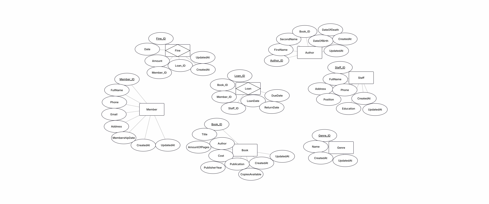
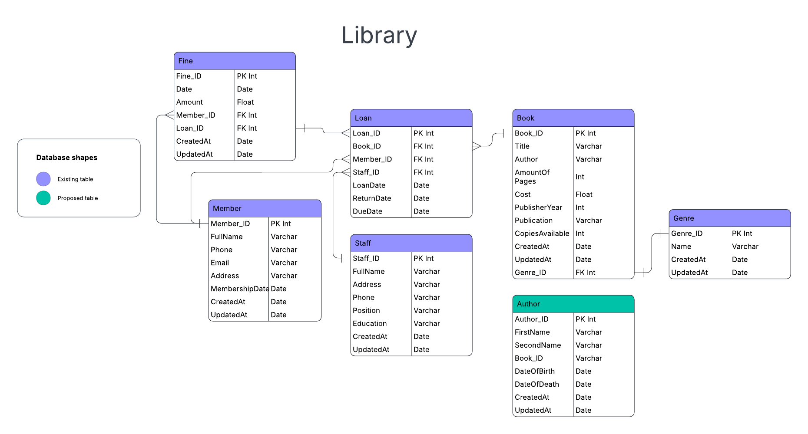

# Лабораторна робота 1: Проектування бази даних бібліотечної системи

## Зміст
1. [ER-діаграма (Чен)](#1-er-діаграма-чен)
2. [ER-діаграма (Crow's Foot)](#2-er-діаграма-crows-foot)
3. [Декларативний опис](#3-декларативний-опис)
4. [Відображення у коді](#4-відображення-у-коді)

---

## 1. ER-діаграма (Чен)



### Опис сутностей та зв'язків:

**Сутності:**
- **Author** (Автор)
  - Author_ID (PK) - унікальний ідентифікатор автора
  - FirstName - ім'я автора
  - SecondName - прізвище автора
  - DateOfBirth - дата народження
  - DateOfDeath - дата смерті (може бути NULL)
  - CreatedAt - дата створення запису
  - UpdatedAt - дата оновлення запису

- **Genre** (Жанр)
  - Genre_ID (PK) - унікальний ідентифікатор жанру
  - Name - назва жанру
  - CreatedAt - дата створення запису
  - UpdatedAt - дата оновлення запису

- **Book** (Книга)
  - Book_ID (PK) - унікальний ідентифікатор книги
  - Title - назва книги
  - AmountOfPages - кількість сторінок
  - Cost - вартість книги
  - PublisherYear - рік видання
  - Publication - видавництво
  - CopiesAvailable - кількість доступних примірників
  - CreatedAt - дата створення запису
  - UpdatedAt - дата оновлення запису

- **Member** (Член бібліотеки)
  - Member_ID (PK) - унікальний ідентифікатор члена
  - FullName - повне ім'я
  - Address - адреса
  - Phone - телефон
  - Email - електронна пошта
  - MemberShipDate - дата вступу до бібліотеки
  - CreatedAt - дата створення запису
  - UpdatedAt - дата оновлення запису

- **Staff** (Співробітник)
  - Staff_ID (PK) - унікальний ідентифікатор співробітника
  - FullName - повне ім'я
  - Address - адреса
  - Phone - телефон
  - Position - посада
  - Education - освіта
  - CreatedAt - дата створення запису
  - UpdatedAt - дата оновлення запису

- **Loan** (Видача книги)
  - Loan_ID (PK) - унікальний ідентифікатор видачі
  - LoanDate - дата видачі
  - ReturnDate - дата повернення (може бути NULL, якщо книга ще не повернена)
  - DueDate - термін повернення

- **Fine** (Штраф)
  - Fine_ID (PK) - унікальний ідентифікатор штрафу
  - Date - дата нарахування штрафу
  - Amount - сума штрафу
  - CreatedAt - дата створення запису
  - UpdatedAt - дата оновлення запису

**Зв'язки:**

| Зв'язок | Тип | Опис |
|---------|-----|------|
| Author **WRITES** Book | 1:N | Один автор пише одну або багато книг |
| Genre **HAS** Book | 1:N | Один жанр включає одну або багато книг |
| Member **BORROWS** Loan | 1:N | Один читач може здійснити багато позик (Optional: читач може не мати активних позик) |
| Staff **PROCESSES** Loan | 1:N | Один співробітник оформлює багато позик |
| Loan **CONTAINS** Book | 1:1 | Один запис про позику стосується однієї конкретної книги |
| Loan **INCURS** Fine | 1:1 | Одна позика може спричинити один штраф (Optional: штрафу може не бути; Identifying: штраф ідентифікується через позику) |

---

## 2. ER-діаграма (Crow's Foot)



### Позначення зв'язків:

- **Genre → Book**: один-до-багатьох (1:N)
  - Один жанр може містити багато книг
  - Кожна книга належить одному жанру (обов'язковий зв'язок)

- **Book → Loan**: один-до-багатьох (1:N)
  - Одна книга може бути видана багато разів
  - Кожна видача стосується однієї книги (обов'язковий зв'язок)

- **Member → Loan**: один-до-багатьох (1:N)
  - Один член може взяти багато книг
  - Кожна видача належить одному члену (обов'язковий зв'язок)

- **Staff → Loan**: один-до-багатьох (1:N)
  - Один співробітник може обробити багато видач
  - Кожна видача обробляється одним співробітником (обов'язковий зв'язок)

- **Loan → Fine**: один-до-багатьох (1:N)
  - Одна видача може мати багато штрафів
  - Кожен штраф стосується однієї видачі (обов'язковий зв'язок)

- **Member → Fine**: один-до-багатьох (1:N)
  - Один член може мати багато штрафів
  - Кожен штраф належить одному члену (обов'язковий зв'язок)

---

## 3. Декларативний опис

### 3.1. Опис сутностей та їх атрибутів

#### Author (Автор)
```
Author (
    Author_ID: INTEGER PRIMARY KEY,
    FirstName: VARCHAR(100) NOT NULL,
    SecondName: VARCHAR(100) NOT NULL,
    DateOfBirth: DATE NOT NULL,
    DateOfDeath: DATE,
    CreatedAt: TIMESTAMP NOT NULL,
    UpdatedAt: TIMESTAMP NOT NULL
)
```

#### Genre (Жанр)
```
Genre (
    Genre_ID: INTEGER PRIMARY KEY,
    Name: VARCHAR(50) NOT NULL UNIQUE,
    CreatedAt: TIMESTAMP NOT NULL,
    UpdatedAt: TIMESTAMP NOT NULL
)
```

#### Book (Книга)
```
Book (
    Book_ID: INTEGER PRIMARY KEY,
    Title: VARCHAR(255) NOT NULL,
    Genre_ID: INTEGER NOT NULL,
    AmountOfPages: INTEGER NOT NULL CHECK (AmountOfPages > 0),
    Cost: DECIMAL(10,2) NOT NULL CHECK (Cost >= 0),
    PublisherYear: INTEGER NOT NULL,
    Publication: VARCHAR(100),
    CopiesAvailable: INTEGER NOT NULL CHECK (CopiesAvailable >= 0),
    CreatedAt: TIMESTAMP NOT NULL,
    UpdatedAt: TIMESTAMP NOT NULL,
    FOREIGN KEY (Genre_ID) REFERENCES Genre(Genre_ID)
)
```

#### Member (Член бібліотеки)
```
Member (
    Member_ID: INTEGER PRIMARY KEY,
    FullName: VARCHAR(200) NOT NULL,
    Address: VARCHAR(255) NOT NULL,
    Phone: VARCHAR(20) NOT NULL,
    Email: VARCHAR(100) NOT NULL UNIQUE,
    MemberShipDate: DATE NOT NULL,
    CreatedAt: TIMESTAMP NOT NULL,
    UpdatedAt: TIMESTAMP NOT NULL
)
```

#### Staff (Співробітник)
```
Staff (
    Staff_ID: INTEGER PRIMARY KEY,
    FullName: VARCHAR(200) NOT NULL,
    Address: VARCHAR(255) NOT NULL,
    Phone: VARCHAR(20) NOT NULL,
    Position: VARCHAR(100) NOT NULL,
    Education: VARCHAR(200),
    CreatedAt: TIMESTAMP NOT NULL,
    UpdatedAt: TIMESTAMP NOT NULL
)
```

#### Loan (Видача книги)
```
Loan (
    Loan_ID: INTEGER PRIMARY KEY,
    Book_ID: INTEGER NOT NULL,
    Member_ID: INTEGER NOT NULL,
    Staff_ID: INTEGER NOT NULL,
    LoanDate: DATE NOT NULL,
    ReturnDate: DATE,
    DueDate: DATE NOT NULL,
    FOREIGN KEY (Book_ID) REFERENCES Book(Book_ID),
    FOREIGN KEY (Member_ID) REFERENCES Member(Member_ID),
    FOREIGN KEY (Staff_ID) REFERENCES Staff(Staff_ID),
    CHECK (ReturnDate IS NULL OR ReturnDate >= LoanDate),
    CHECK (DueDate >= LoanDate)
)
```

#### Fine (Штраф)
```
Fine (
    Fine_ID: INTEGER PRIMARY KEY,
    Loan_ID: INTEGER NOT NULL,
    Member_ID: INTEGER NOT NULL,
    Date: DATE NOT NULL,
    Amount: DECIMAL(10,2) NOT NULL CHECK (Amount > 0),
    CreatedAt: TIMESTAMP NOT NULL,
    UpdatedAt: TIMESTAMP NOT NULL,
    FOREIGN KEY (Loan_ID) REFERENCES Loan(Loan_ID),
    FOREIGN KEY (Member_ID) REFERENCES Member(Member_ID)
)
```

### 3.2. Опис зв'язків між сутностями

1. **Genre ↔ Book** (1:N)
   - Тип: один-до-багатьох
   - Участь: повна з боку Book (кожна книга має жанр)
   - Участь: часткова з боку Genre (жанр може не мати книг)
   - Атрибут зв'язку: відсутній (зв'язок реалізований через зовнішній ключ Genre_ID в Book)

2. **Book ↔ Loan** (1:N)
   - Тип: один-до-багатьох
   - Участь: повна з боку Loan (кожна видача стосується книги)
   - Участь: часткова з боку Book (книга може не бути видана)
   - Атрибут зв'язку: відсутній (зв'язок реалізований через зовнішній ключ Book_ID в Loan)

3. **Member ↔ Loan** (1:N)
   - Тип: один-до-багатьох
   - Участь: повна з боку Loan (кожна видача належить члену)
   - Участь: часткова з боку Member (член може не мати видач)
   - Атрибут зв'язку: відсутній (зв'язок реалізований через зовнішній ключ Member_ID в Loan)

4. **Staff ↔ Loan** (1:N)
   - Тип: один-до-багатьох
   - Участь: повна з боку Loan (кожна видача обробляється співробітником)
   - Участь: часткова з боку Staff (співробітник може не обробляти видач)
   - Атрибут зв'язку: відсутній (зв'язок реалізований через зовнішній ключ Staff_ID в Loan)

5. **Loan ↔ Fine** (1:N)
   - Тип: один-до-багатьох
   - Участь: повна з боку Fine (кожен штраф стосується видачі)
   - Участь: часткова з боку Loan (видача може не мати штрафів)
   - Атрибут зв'язку: відсутній (зв'язок реалізований через зовнішній ключ Loan_ID в Fine)

6. **Member ↔ Fine** (1:N)
   - Тип: один-до-багатьох
   - Участь: повна з боку Fine (кожен штраф належить члену)
   - Участь: часткова з боку Member (член може не мати штрафів)
   - Атрибут зв'язку: відсутній (зв'язок реалізований через зовнішній ключ Member_ID в Fine)

### 3.3. Правила цілісності даних

1. **Первинні ключі (Primary Keys)**:
   - Кожна таблиця має унікальний первинний ключ (ID)
   - Первинні ключі не можуть бути NULL

2. **Зовнішні ключі (Foreign Keys)**:
   - Book.Genre_ID → Genre.Genre_ID (каскадне видалення заборонено)
   - Loan.Book_ID → Book.Book_ID (каскадне видалення заборонено)
   - Loan.Member_ID → Member.Member_ID (каскадне видалення заборонено)
   - Loan.Staff_ID → Staff.Staff_ID (каскадне видалення заборонено)
   - Fine.Loan_ID → Loan.Loan_ID (каскадне видалення заборонено)
   - Fine.Member_ID → Member.Member_ID (каскадне видалення заборонено)

3. **Обмеження (Constraints)**:
   - AmountOfPages > 0
   - Cost >= 0
   - CopiesAvailable >= 0
   - Amount > 0 (для Fine)
   - ReturnDate >= LoanDate (якщо ReturnDate не NULL)
   - DueDate >= LoanDate
   - Email унікальний для Member
   - Name унікальний для Genre

---

## 4. Відображення у коді

### 4.1. Структури даних у TypeScript

Проект використовує TypeScript інтерфейси для опису структури даних. Нижче наведено перетворення ER-моделі у код:

#### Базові інтерфейси

```typescript
// common.ts
export interface Common {
    id: number;              // Первинний ключ (PK)
    createdAt: Date;
    updatedAt: Date;
}

export interface Person extends Common {
    fullName: string;
    address: string;
    phone: string;
}
```

**Перетворення**: Базовий інтерфейс `Common` містить первинний ключ `id` та метадані. Інтерфейс `Person` розширює `Common` для спільних атрибутів особи.

#### Сутність Author

```typescript
// author.ts
import { Common } from "./common";

export interface Author extends Common {
    firstName: string;
    secondName: string;
    dateOfBirth: Date;
    dateOfDeath: Date;
}
```

**Перетворення**: 
- Сутність Author → інтерфейс `Author`
- Атрибут `id` (PK) успадковується від `Common`
- Всі атрибути Author представлені як властивості інтерфейсу

#### Сутність Genre

```typescript
// genre.ts
import { Common } from "./common";

export interface Genre extends Common {
    name: string;
}
```

**Перетворення**: 
- Сутність Genre → інтерфейс `Genre`
- Атрибут `id` (PK) успадковується від `Common`
- Атрибут `name` представлений як властивість

#### Сутність Book

```typescript
// book.ts
import { Common } from "./common";

export interface Book extends Common {
    title: string;
    amountOfPages: number;
    cost: number;
    publisherYear: Date;
    publication: string;
    copiesAvailable: number;
}
```

**Перетворення**: 
- Сутність Book → інтерфейс `Book`
- Атрибут `id` (PK) успадковується від `Common`
- Зв'язок з Genre реалізований через зовнішній ключ `Genre_ID` в JSON-схемі

**Примітка**: У TypeScript інтерфейсі зв'язки можуть бути представлені як рядки або об'єкти, але в JSON-схемі вони є зовнішніми ключами (integer). Сутність Author поки що не прив'язана до Book.

#### Сутність Member

```typescript
// member.ts
import { Person } from "./common";

export interface Member extends Person {
    email: string;
    memberShipDate: Date;
}
```

**Перетворення**: 
- Сутність Member → інтерфейс `Member`
- Успадковує від `Person`, який містить `id` (PK), `fullName`, `address`, `phone`
- Додаткові атрибути `email` та `memberShipDate` додані безпосередньо

#### Сутність Staff

```typescript
// staff.ts
import { Person } from "./common";

export interface Staff extends Person {
    position: string;
    education: string;
}
```

**Перетворення**: 
- Сутність Staff → інтерфейс `Staff`
- Успадковує від `Person`, який містить `id` (PK), `fullName`, `address`, `phone`
- Додаткові атрибути `position` та `education` додані безпосередньо

#### Сутність Loan

```typescript
// loan.ts
import { Common } from "./common";

export interface Loan extends Common {
    LoanDate: Date;
    ReturnDate: Date;
    DueDate: Date;
}
```

**Перетворення**: 
- Сутність Loan → інтерфейс `Loan`
- Атрибут `id` (PK) успадковується від `Common`
- Зв'язки з Book, Member та Staff реалізовані через зовнішні ключі в JSON-схемі:
  - `Book_ID` (FK) → Book
  - `Member_ID` (FK) → Member
  - `Staff_ID` (FK) → Staff

#### Сутність Fine

```typescript
// fine.ts
import { Common } from "./common";

export interface Fine extends Common {
    date: Date;
    Amount: number;
}
```

**Перетворення**: 
- Сутність Fine → інтерфейс `Fine`
- Атрибут `id` (PK) успадковується від `Common`
- Зв'язки з Loan та Member реалізовані через зовнішні ключі в JSON-схемі:
  - `Loan_ID` (FK) → Loan
  - `Member_ID` (FK) → Member

### 4.2. JSON-схеми (декларативний опис структури)

JSON-схеми визначають структуру даних та обмеження на рівні валідації:

#### Book Schema

```json
{
  "$id": "Book",
  "type": "object",
  "properties": {
    "Book_ID": { "type": "integer" },        // PK
    "Title": { "type": "string" },
    "Genre_ID": { "type": "integer" },       // FK → Genre
    "AmountOfPages": { "type": "integer" },
    "Cost": { "type": "number" },
    "PublisherYear": { "type": "integer" },
    "Publication": { "type": "string" },
    "CopiesAvailable": { "type": "integer" },
    "CreatedAt": { "type": "string", "format": "date" },
    "UpdatedAt": { "type": "string", "format": "date" }
  },
  "required": ["Book_ID", "Title", "Genre_ID"]
}
```

**Перетворення зв'язків**:
- Зв'язок Genre ↔ Book (1:N) реалізований через `Genre_ID` (FK) в Book

#### Loan Schema

```json
{
  "$id": "Loan",
  "type": "object",
  "properties": {
    "Loan_ID": { "type": "integer" },        // PK
    "Book_ID": { "type": "integer" },        // FK → Book
    "Member_ID": { "type": "integer" },      // FK → Member
    "Staff_ID": { "type": "integer" },       // FK → Staff
    "LoanDate": { "type": "string", "format": "date" },
    "ReturnDate": { "type": "string", "format": "date" },
    "DueDate": { "type": "string", "format": "date" }
  },
  "required": ["Loan_ID", "Book_ID", "Member_ID", "Staff_ID", "LoanDate"]
}
```

**Перетворення зв'язків**:
- Зв'язок Book ↔ Loan (1:N) реалізований через `Book_ID` (FK) в Loan
- Зв'язок Member ↔ Loan (1:N) реалізований через `Member_ID` (FK) в Loan
- Зв'язок Staff ↔ Loan (1:N) реалізований через `Staff_ID` (FK) в Loan

#### Fine Schema

```json
{
  "$id": "Fine",
  "type": "object",
  "properties": {
    "Fine_ID": { "type": "integer" },        // PK
    "Date": { "type": "string", "format": "date" },
    "Amount": { "type": "number" },
    "Member_ID": { "type": "integer" },      // FK → Member
    "Loan_ID": { "type": "integer" },        // FK → Loan
    "CreatedAt": { "type": "string", "format": "date" },
    "UpdatedAt": { "type": "string", "format": "date" }
  },
  "required": ["Fine_ID", "Member_ID", "Loan_ID", "Amount"]
}
```

**Перетворення зв'язків**:
- Зв'язок Loan ↔ Fine (1:N) реалізований через `Loan_ID` (FK) в Fine
- Зв'язок Member ↔ Fine (1:N) реалізований через `Member_ID` (FK) в Fine

### 4.3. Правила перетворення ER-моделі у структури даних

#### Правило 1: Сутності → Інтерфейси/Класи
- Кожна сутність ER-діаграми перетворюється на інтерфейс TypeScript або клас
- Атрибути сутності стають властивостями інтерфейсу/класу
- Первинний ключ (PK) завжди представлений як `id: number` або `Entity_ID: integer`

#### Правило 2: Зв'язки один-до-багатьох (1:N)
- Зв'язок 1:N реалізується через зовнішній ключ (FK) в таблиці "багатьох"
- У TypeScript інтерфейсі FK може бути представлений як:
  - `foreignKeyId: number` (простий підхід)
  - `foreignEntity: ForeignEntity` (об'єкт з повною інформацією)
- У JSON-схемі FK завжди представлений як `integer`

**Приклад**: 
- ER: Genre (1) ↔ Book (N)
- Код: `Book` містить `Genre_ID: integer` (FK)

#### Правило 3: Зв'язки багато-до-багатьох (M:N)
- У даній моделі немає зв'язків M:N
- Якщо б був зв'язок M:N, він би реалізувався через проміжну таблицю (junction table)

#### Правило 4: Наслідування
- Спільні атрибути виносяться в базовий інтерфейс (`Common`, `Person`)
- Спеціалізовані сутності успадковують базовий інтерфейс через `extends`

**Приклад**:
- `Member extends Person` - Member успадковує `id`, `fullName`, `address`, `phone` від Person
- `Author extends Common` - Author успадковує `id`, `createdAt`, `updatedAt` від Common

#### Правило 5: Обов'язковість атрибутів
- У JSON-схемі обов'язкові атрибути вказуються в масиві `required`
- У TypeScript обов'язковість визначається відсутністю `?` після імені властивості

#### Правило 6: Типи даних
- `VARCHAR` → `string`
- `INTEGER` → `number`
- `DECIMAL` → `number`
- `DATE` → `Date` (TypeScript) або `string` з форматом `"date"` (JSON Schema)
- `TIMESTAMP` → `Date` (TypeScript) або `string` з форматом `"date"` (JSON Schema)

### 4.4. Візуалізація перетворення

```
ER-Модель                    →  Структури даних
─────────────────────────────────────────────────────
Сутність Author              →  interface Author
  - Author_ID (PK)           →    id: number
  - FirstName                →    firstName: string
  - SecondName               →    secondName: string
  - DateOfBirth              →    dateOfBirth: Date
  - DateOfDeath              →    dateOfDeath: Date

Сутність Book                →  interface Book
  - Book_ID (PK)             →    id: number
  - Title                    →    title: string
  - Genre_ID (FK)            →    (в JSON: Genre_ID: integer)
  - AmountOfPages            →    amountOfPages: number
  - Cost                     →    cost: number

Зв'язок Genre ↔ Book (1:N)  →  Book.Genre_ID (FK) → Genre.id (PK)
```

---

## Висновок

У даній лабораторній роботі було спроектовано базу даних бібліотечної системи, яка включає:

- **7 сутностей**: Author, Genre, Book, Member, Staff, Loan, Fine
- **6 зв'язків типу один-до-багатьох (1:N)**
- **Чітке визначення первинних та зовнішніх ключів**
- **Декларативний опис структури даних**
- **Реалізацію у вигляді TypeScript інтерфейсів та JSON-схем**

Всі зв'язки між сутностями реалізовані через зовнішні ключі, що забезпечує цілісність даних та дозволяє ефективно виконувати запити з об'єднанням таблиць.

